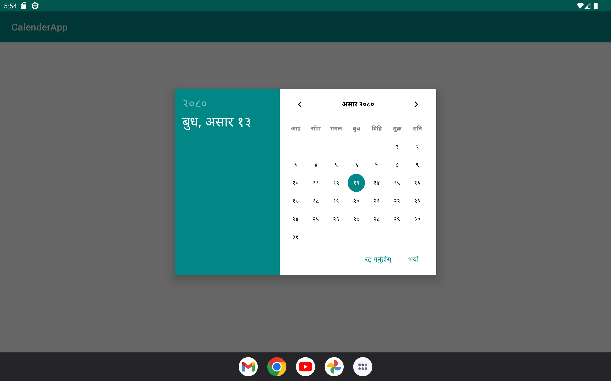
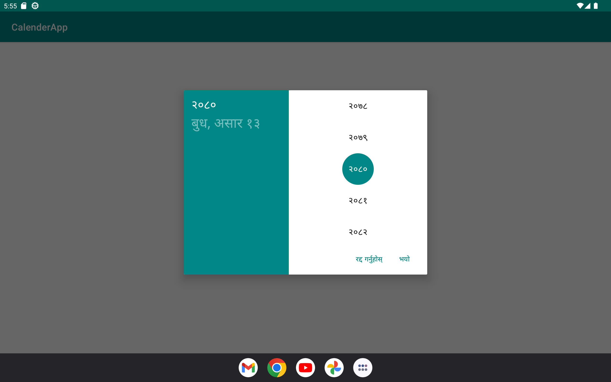
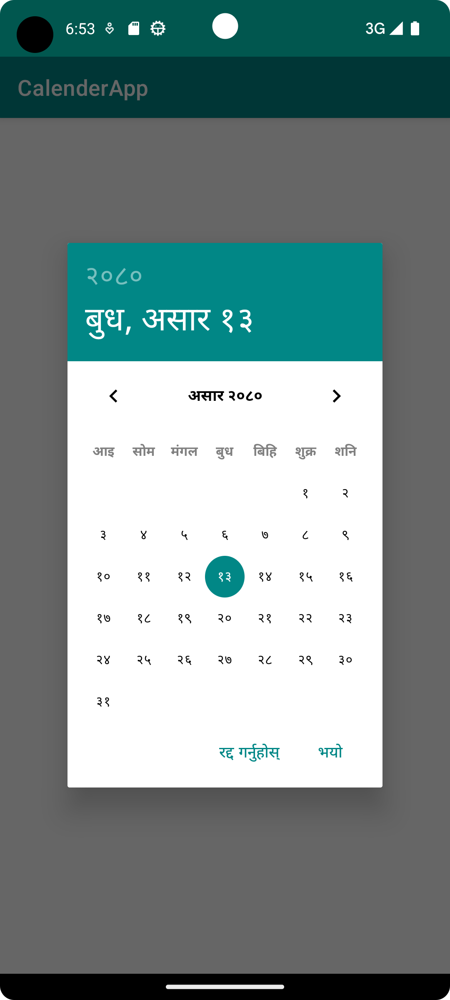
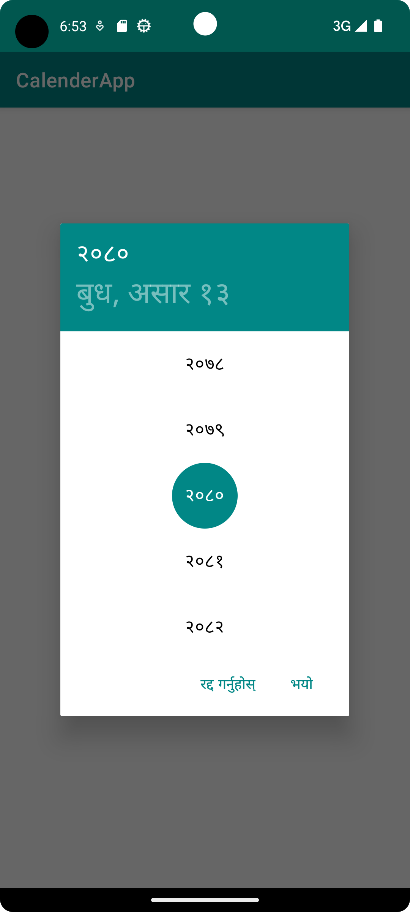

# Android Nepali Calendar Picker Library

Android Nepali Calendar Picker is an Android library that provides a customizable date picker specifically designed for the Nepali calendar. It allows users to select dates from the Nepali calendar with ease.

The library offers various customization options, including theme customization and date range restrictions. It aims to simplify the integration of a Nepali calendar picker into Android applications, making it convenient for developers to incorporate Nepali date selection functionality.


## Features

- **Nepali Calendar Support:** The library supports the Nepali calendar, allowing users to select dates based on the Nepali date system.

- **Date Selection:** Users can easily select dates from the Nepali calendar by interacting with the date picker.

- **Customization:** The library provides themes customization options and date range restrictions, to adapt the date picker to the application's visual style and requirements.

- **Simple Integration:** The library offers a simple and straightforward integration process, making it easy for developers to add a Nepali calendar picker to their Android applications.

## Screenshots

### Tablet 



### Mobile 




## Installation

To use Android Nepali Calendar Picker in your Android project, follow these steps:

Step 1: Add the library dependency to your module-level build.gradle file

```kotlin
dependencies {
    implementation project(path: ':android-nepali-calendar-picker-lib')
}
```

Step 2: Sync your project with gradle

## Usage/Examples

**Inside Activity:**

```kotlin
   val dialog = NepaliDatePicker.newInstance(this)
   dialog.show(supportFragmentManager, "Datepickerdialog")
```
```kotlin
    override fun onDateSet(year: String, month: String, day: String) {
      //code
    }
```
**Inside Fragment:**

```kotlin
   val dialog = NepaliDatePicker.newInstance(this)
   dialog.show(childFragmentManager, "Datepickerdialog")
```
```kotlin
    override fun onDateSet(year: String, month: String, day: String) {
      //code
    }
```
## Customization

The Android Nepali Calendar Picker provides several customization options to tailor the appearance and behavior of the date picker. Here are some of the available customization methods:

- **setStart(year: Int, month: Int, day: Int):** Sets the minimum selectable date.

```kotlin
   val dialog = NepaliDatePicker.newInstance(this)
   dialog.show(supportFragmentManager, "Datepickerdialog")
   dialog.setStart(2070,3,3)
```
- **setEnd(year: Int, month: Int, day: Int):** Sets the maximum selectable date.

```kotlin
   val dialog = NepaliDatePicker.newInstance(this)
   dialog.show(supportFragmentManager, "Datepickerdialog")
   dialog.setEnd(2080,3,12)
```
- **setThemeColor(hex: String):** Sets the theme color for the library

```kotlin
   val dialog = NepaliDatePicker.newInstance(this)
   dialog.show(supportFragmentManager, "Datepickerdialog")
   dialog.setThemeColor("#FF3700B3")
```
- **setRange(startDate: Long, endDate: Long):** Sets the selectable date range.

```kotlin
   val dialog = NepaliDatePicker.newInstance(this)
   dialog.show(supportFragmentManager, "Datepickerdialog")
   val startDate = DateConverter.convertToTimestamp(2060,3,12)
   val endDate = DateConverter.convertToTimestamp(2070,6,12)
   dialog.setRange(startDate,endDate)
```
- **setVibration(vibrate : Boolean):** Allows for the activation or deactivation of device vibration. When enabled, the device will vibrate to provide haptic feedback upon selecting a day in the calendar.

```kotlin
   val dialog = NepaliDatePicker.newInstance(this)
   dialog.show(supportFragmentManager, "Datepickerdialog")
   newFragment.setVibration(true)
```
- **setMinAge(age: Int):** Enforce age restrictions, ensuring that only dates beyond the specified minimum age can be selected.

```kotlin
   val dialog = NepaliDatePicker.newInstance(this)
   dialog.show(supportFragmentManager, "Datepickerdialog")
   newFragment.setMinAge(18)
```
- **setInitialDateSelection(year: Int, month: Int, day: Int):** Preselect a specific date, ensuring that the calendar starts with the desired date already highlighted or chosen.

```kotlin
   val dialog = NepaliDatePicker.newInstance(this)
   dialog.show(supportFragmentManager, "Datepickerdialog")
   newFragment.setInitialDateSelection(2074, 11, 12)
```
